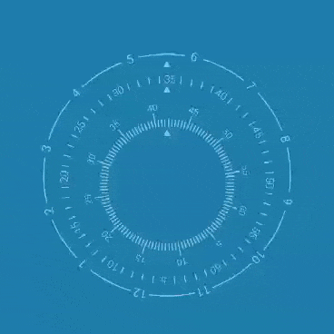

# Dreamground

Dreamground.一些动态的背景自定义控件。

## Import

###### Step 1. Add the JitPack repository to your build file

Add it in your root build.gradle at the end of repositories:

	allprojects {
		repositories {
			...
			maven { url 'https://jitpack.io' }
		}
	}

###### Step 2. Add the dependency

	dependencies {
	        implementation 'com.github.dyguests:Dreamground:x.y.z'
	}

## Usage

    <com.fanhl.dreamground.SkyClockView
        android:layout_width="match_parent"
        android:layout_height="match_parent"/>

## Config

    <declare-styleable name="RippleView">
        <attr name="bgColor" format="color" />
        <attr name="rippleType" format="enum">
            <enum name="ripple" value="0" />
            <enum name="drop" value="1" />
        </attr>
        <attr name="rippleColor" format="color" />
        <attr name="rippleRadius" format="dimension" />
        <attr name="rippleRadiusFluctuation" format="float" />
        <attr name="rippleLifetime" format="integer" />
        <attr name="rippleIncubateInterval" format="integer" />
        <attr name="rippleIncubateIntervalFluctuation" format="float" />
    </declare-styleable>

## TODO

- [ ] onPause process.

## Reference

1. [60.自定义View练习（五）高仿小米时钟 - 使用Camera和Matrix实现3D效果](https://blog.csdn.net/qq_31715429/article/details/54668668)

2. [MonkeyMushroom/MiClockView](https://github.com/MonkeyMushroom/MiClockView)